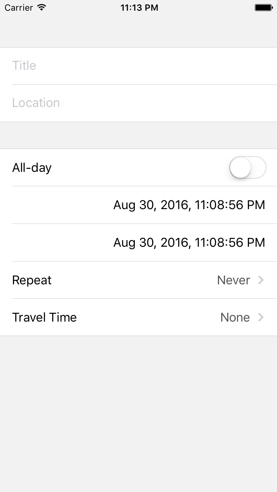

# StackScrollViewComponents

[](https://travis-ci.org/muukii/StackScrollViewComponents)
[](http://cocoapods.org/pods/StackScrollViewComponents)
[](http://cocoapods.org/pods/StackScrollViewComponents)
[](http://cocoapods.org/pods/StackScrollViewComponents)

**Work in progress**

**Very Scalable** iOS form builder with **UIScrollView**

**Work in progress**<br>
**I can’t wait your PR:laughing:**

- [StackScrollView](https://github.com/muukii/StackScrollView) (Core) parent repository
    - UI Components (This repository)

## Example



## Requirements

## Installation

StackScrollViewComponents is available through [CocoaPods](http://cocoapods.org). To install
it, simply add the following line to your Podfile:

```ruby
pod "StackScrollViewComponents"
```

## Author

muukii, m@muukii.me

## License

StackScrollViewComponents is available under the MIT license. See the LICENSE file for more info.
